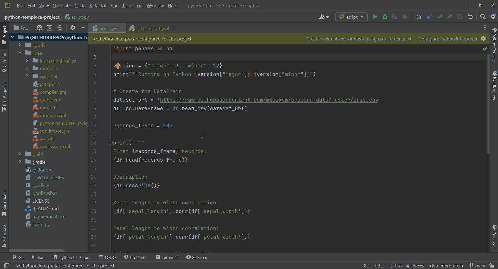

# SDK-Import Intellij Plugin


[](https://plugins.jetbrains.com/plugin/com.pswidersk.sdkimportplugin)
[](https://plugins.jetbrains.com/plugin/com.pswidersk.sdkimportplugin)

<!-- Plugin description -->

Plugin to add support for specifying global SDK definitions at the project level.
It loads YML config file to define language SDK for the specific module or project.

### Configuration file

In order to import custom SDKs to IDE, the `sdk-import.yml` file has to be created in the parent `.idea` directory.

For example:

```yml
import:
  - module: "python-data-science-samples"
    path: "C:/PYTHON/Miniconda3-py312_24.1.2-0/envs/python-3.12.2/python.exe"
    type: "PYTHON"
  - module: "python-data-science-samples.jupyter-notebook"
    path: "C:/PYTHON/Miniconda3-py312_24.1.2-0/envs/python-3.9.1/python.exe"
    type: "PYTHON"
  - module: "python-data-science-samples.java-samples"
    path: "C:\\JAVA\\.gradle\\jdks\\adoptium-18-x64-hotspot-windows"
    type: "JAVA"
```

Where:

* `module` should match the Intellij's module name. Nested modules are separated with `.`. For the module name matching
  project name SDK will be also added to the Project,
* `path` is the location of SDK on files system,
* `type` should be one of the supported SDKs enumerate values,

### Import action

In order to load the config file, developer has to choose **"Tools" -> "Reimport SDK"** action.

After Intellij will load the SDK and index the files, code autocompletion should be enabled.

### Supported SDKs

The Plugin supports the following SDKs:

* Python (`PYTHON` import type)
* Java (`JAVA` import type)

### Python Support

This plugin can cooperate with [**Python Gradle Plugin**](https://github.com/PrzemyslawSwiderski/python-gradle-plugin)
to
make working with multimodule projects easier.

<!-- Plugin description end -->

## Installation

- Using the IDE built-in plugin system:

  <kbd>Settings/Preferences</kbd> > <kbd>Plugins</kbd> > <kbd>Marketplace</kbd> > <kbd>Search for "SDK-Import"</kbd> >
  <kbd>Install</kbd>

- Manually:

  Download the [latest release](https://github.com/PrzemyslawSwiderski/sdk-import-plugin/releases/latest) and install it
  manually using
  <kbd>Settings/Preferences</kbd> > <kbd>Plugins</kbd> > <kbd>⚙️</kbd> > <kbd>Install plugin from disk...</kbd>

## Running



---
Plugin based on the [IntelliJ Platform Plugin Template][template].

[template]: https://github.com/JetBrains/intellij-platform-plugin-template

[docs:plugin-description]: https://plugins.jetbrains.com/docs/intellij/plugin-user-experience.html#plugin-description-and-presentation
